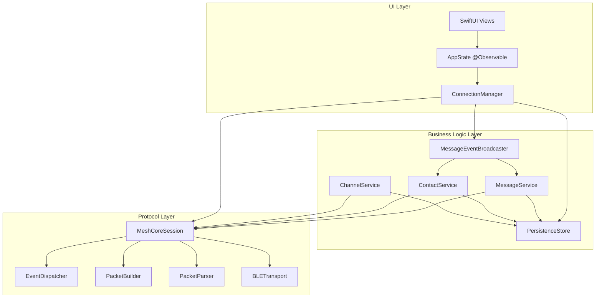

# PocketMesh Architecture

PocketMesh is built using a modern, three-tier modular architecture designed for high performance, reliability, and maintainability. It leverages Swift 6's strict concurrency model, actor isolation, and modern iOS frameworks.

## High-Level Architecture

The project is divided into three main layers:

1.  **MeshCore (Protocol Layer)**: A pure Swift implementation of the MeshCore mesh networking protocol.
2.  **PocketMeshServices (Business Logic Layer)**: Manages higher-level business logic, actor isolation, and shared persistence.
3.  **PocketMesh (UI Layer)**: The SwiftUI-based user interface and application state management.

---

## 1. MeshCore (Protocol Layer)

The foundation of the project, responsible for low-level communication with MeshCore devices.

-   **Actor-Based**: `MeshCoreSession` is an actor that serializes all device communication, ensuring thread safety.
-   **Event-Driven**: Uses an `EventDispatcher` to broadcast `MeshEvent`s via `AsyncStream`.
-   **Stateless Protocol Handlers**: `PacketBuilder` and `PacketParser` are stateless enums that handle the binary encoding/decoding of the Companion Radio Protocol.
-   **Transport Abstraction**: The `MeshTransport` protocol allows for different underlying transports, such as `BLETransport` (using CoreBluetooth) or `MockTransport` (for unit testing).
-   **LPP Telemetry**: Includes a full implementation of the Cayenne Low Power Payload (LPP) for efficient sensor data transmission.

---

## 2. PocketMeshServices (Business Logic Layer)

Bridges the protocol layer and the UI, handling complex business rules and data persistence.

-   **Service-Oriented**: Business logic is divided into specialized actors (`MessageService`, `ContactService`, `ChannelService`, etc.).
-   **Actor Isolation**: Every service is an actor, protecting internal state and coordinating asynchronous operations safely.
-   **Persistence**: Uses **SwiftData** for local storage. Data is isolated per device using the device's public key as a namespace.
-   **Connection Management**: `ConnectionManager` (a `@MainActor` observable class) manages the lifecycle of the connection, including pairing via **AccessorySetupKit**, auto-reconnection, and service wiring.
-   **Event Broadcasting**: `MessageEventBroadcaster` coordinates events across services and provides a unified stream for the UI.

---

## 3. PocketMesh (UI Layer)

A modern SwiftUI application that provides a user-friendly experience for mesh messaging.

-   **AppState**: A central `@Observable` class that manages app-wide state, navigation, and coordination between the UI and services.
-   **SwiftUI & Modern APIs**: Built with the latest SwiftUI features, utilizing `@Observable`, environment injection, and modern navigation.
-   **Onboarding Flow**: A guided experience for permissions, discovery, and device pairing.
-   **iMessage-Style Chat**: Rich messaging interface with delivery status, timestamps, and metadata (SNR, path length).
-   **MapKit Integration**: Displays contact locations on a map with real-time updates and type-based markers.

---

## Concurrency & Data Flow

### Concurrency Model
PocketMesh strictly adheres to the **Swift 6 concurrency model**:
-   **Actors**: Used for all services and session management to prevent data races.
-   **MainActor**: UI updates and the `ConnectionManager` are isolated to the main thread.
-   **AsyncStream**: Used for all event-driven communication (BLE data -> Protocol events -> Business events -> UI updates).
-   **Structured Concurrency**: Utilizes `TaskGroups` for complex asynchronous flows like message retries and contact synchronization.

### Data Flow (Receiving a Message)
1.  **BLE Transport**: `BLETransport` receives a notification from CoreBluetooth and yields the data to its `receivedData` stream.
2.  **Session Parser**: `MeshCoreSession` receives the data, uses `PacketParser` to create a `MeshEvent`, and dispatches it.
3.  **Service Processing**: `MessagePollingService` (or `MessageService`) receives the event, processes the payload, and saves it to the `PersistenceStore`.
4.  **UI Update**: `MessageEventBroadcaster` detects the new message and notifies `AppState`.
5.  **Reactive UI**: SwiftUI views observing `AppState` or relevant view models update automatically to display the new message.

## Persistence Layer

-   **Technology**: SwiftData.
-   **Isolation**: Each MeshCore device has its own isolated data store, ensuring privacy and preventing data mixing.
-   **Models**:
    -   `Device`: Metadata, radio parameters, and capabilities.
    -   `Contact`: Public keys, names, types (Chat, Repeater, Room), and location data.
    -   `Message`: Content, timestamps, delivery status, and mesh metadata (SNR, Path).
    -   `Channel`: Slot-based configuration for group messaging.
